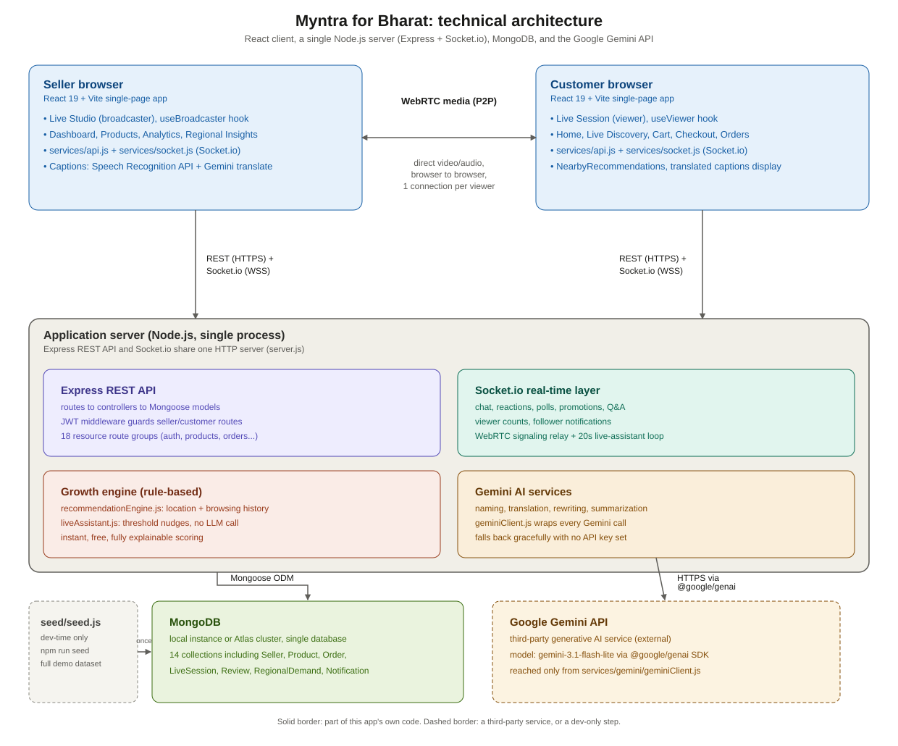

# Myntra for Bharat: a live-commerce prototype for Tier-2/Tier-3 India

Built for the "Build What's Next: Myntra for Bharat" hackathon track. The project takes on two of the problem statements together: making it easy for a Tier-2/Tier-3 seller to actually sell on Myntra, and building trust with Tier-2/Tier-3 buyers, using live shopping streams as the core mechanic that ties both sides together.

## Demo video

[Project Demo Video](https://drive.google.com/drive/folders/1GJO_yH-op9S0C2-EnV24uPRMv-tcsuyb)

## What this is

The idea started from a simple observation: a seller in a small city often knows their product by a local name long before they know its "marketplace" name, and a buyer in that same city trusts a live seller talking to them far more than a static product listing. So the whole app is built around a live stream as the primary shopping surface, with a few focused features layered on top of it for the Bharat side of the problem:

- A seller can photograph a product, type its local name, and get back both a local and a globally recognizable name and description, generated from the photo.
- A buyer's home screen surfaces sellers and products near them, blending location with their own browsing history, and explains in plain language why each item is being shown.
- A seller-facing Regional Demand board shows which of about 65 Indian cities are trending for their category right now, and why.

## Table of contents

1. [Features](#features)
2. [Tech stack](#tech-stack)
3. [Third-party libraries, APIs and licensing](#third-party-libraries-apis-and-licensing)
4. [Prerequisites](#prerequisites)
5. [Setup](#setup)
6. [Demo logins](#demo-logins)
7. [Where the data comes from](#where-the-data-comes-from)
8. [Trying it out end to end](#trying-it-out-end-to-end)
9. [Project structure](#project-structure)
10. [AI and rule-based features](#ai-and-rule-based-features)
11. [What's real vs. what's approximated](#whats-real-vs-whats-approximated)
12. [Troubleshooting](#troubleshooting)

## Features

### Live shopping, the core loop
Sellers broadcast real video over WebRTC. Shoppers watch, chat, ask questions, react with floating emoji, vote in polls, claim coupons, watch flash-sale countdowns, and buy, all without leaving the stream. A one-click Buy Now opens checkout inline over the live view instead of navigating away from it.

### Local name to global name, for every product
In Add Product, a seller uploads a photo, types their own local name and a rough description, and hits Generate Names. A vision model returns a polished local name and description alongside a globally recognizable one (a *Bandhani Odhna* becomes, for the rest of the country, a "Tie-Dye Dress," while keeping its local name too). Both are saved, and which one shows first on the storefront depends on the shopper: someone from the same region sees the local name by default, a metro shopper sees the global one, and everyone gets a small toggle to flip between them (`client/src/utils/productDisplay.js`).

### Nearby recommendations
The customer home screen has a "Near You" section: nearby sellers, ranked by real distance from lat/lng coordinates (see `haversineKm`), and a "Trending near you" product grid that blends location with the shopper's own browsing history and wishlist categories. Every card carries a plain-language reason, such as "Because you viewed Kurtas recently," so the ranking is explainable rather than a black box.

### Regional Demand board
A seller-facing page that shows, across roughly 65 Tier-2/Tier-3 and metro cities, which cities are hottest for a seller's category right now and why (festival season, a regional trend), plotted as a geo-scatter at each city's real relative latitude and longitude. It isn't a traced map of India, and that choice is explained in the approximations section below.

### Live shopping, customer side
A pinned "now showing" product card with live stock counts, Add to Cart, Buy Now, Wishlist, Share, tap-to-react, live polls, flash-sale countdowns, coupon claim popups, follow-a-seller (which feeds notifications), a separate Q&A tab with upvoting and one-tap quick questions, and live translated captions.

### Live studio, seller side
Camera switch, mic toggle, pause and resume without ending the stream, pin-a-product, a live inventory panel with per-size stock that updates the moment an order comes in, chat moderation (pin, mute, delete), a Q&A panel where answering one question auto-resolves near-duplicate questions from other viewers, a promotions panel (coupon, flash sale, bundle, BOGO, each auto-expiring and notifying followers), a poll creator, on-demand chat summarization, order-placed toasts, and a Live Assistant feed of real-time nudges (deliberately not an LLM call, see the AI section below for why).

### Trust and post-purchase
Order status tracking from placed through delivered, and a ratings and reviews flow once an order is delivered, which recomputes both the product's and the seller's aggregate rating.

### Search
A single overlay that searches products, sellers, and live streams at once.

## Tech stack

**Backend:** Node.js, Express 5, MongoDB with Mongoose, Socket.io for real-time chat/reactions/polls/WebRTC signaling, JWT for auth, and the Gemini API for the generative features.

**Frontend:** React 19, Vite, Tailwind CSS v4, React Router, `lucide-react` for icons, and `socket.io-client` for the real-time layer. Live video runs on the browser's native WebRTC APIs, no third-party video SDK.

## Third-party libraries, APIs and licensing

Everything the project depends on is either a permissively licensed open-source package or a documented public API, and none of it is bundled or redistributed beyond normal `npm install` usage.

**Backend dependencies** (`server/package.json`): Express (MIT), Mongoose (MIT), Socket.io (MIT), `jsonwebtoken` (MIT), `bcryptjs` (MIT), `cors` (MIT), `dotenv` (BSD-2-Clause), and `@google/genai`, Google's official Gen AI SDK (Apache-2.0).

**Frontend dependencies** (`client/package.json`): React and React DOM (MIT), React Router (MIT), Tailwind CSS and `@tailwindcss/vite` (MIT), `lucide-react` (ISC), and `socket.io-client` (MIT). Build tooling (Vite, ESLint and its plugins) is also MIT-licensed and used only at development time, not shipped to end users.

**External APIs:**
- **Google Gemini API**, used for every generative feature listed in the [AI and rule-based features](#ai-and-rule-based-features) table below. Usage is subject to Google's Gemini API terms, and requires your own API key (see [Setup](#setup)). No Gemini-generated content is hard-coded or redistributed; it's generated live from your own key at runtime, or replaced by a clearly labeled fallback if no key is set.
- **Browser Speech Recognition (Web Speech API)**, used for live captions in Chromium-based browsers only. This is a native browser capability, not a third-party library, and nothing is sent anywhere except through the browser's own built-in recognizer.

**Not used:** no UI component library, no charting library, no third-party video/WebRTC SDK, and no analytics or tracking scripts of any kind. The map-style Regional Demand board is hand-built with SVG, not a mapping API, so there's no separate Maps API key or license to worry about.

City names, coordinates, states, and zones in `server/data/geoIndia.js` are approximate public geographic reference data (city-centre coordinates), used only to compute relative distance and position, not sourced from any licensed map provider.

## Prerequisites

- **Node.js 18+** (Node 20+ recommended). Check with `node -v`.
- **npm**, which ships with Node. Check with `npm -v`.
- **MongoDB**, either a local server on `mongodb://127.0.0.1:27017`, or a free [MongoDB Atlas](https://www.mongodb.com/cloud/atlas/register) cluster.
- **Google Chrome or Microsoft Edge** is recommended. Live captions (speech-to-text) only work in Chromium-based browsers; every other feature works in any modern browser.
- *(Optional but recommended)* a free **Gemini API key** from [aistudio.google.com/apikey](https://aistudio.google.com/apikey). Without it, every Gemini-backed feature still works and returns a clearly labeled fallback instead of a live model response. Nothing breaks either way.

## Setup

### Backend (`server/`)

```bash
cd server
npm install
cp .env.example .env
```

Open `server/.env` and fill in:
- `MONGO_URI`, your local or Atlas connection string
- `JWT_SECRET`, any long random string
- `GEMINI_API_KEY`, optional, paste your key here for live AI responses

Seed the database:

```bash
npm run seed
```

This clears and repopulates every collection, so it's safe to re-run any time. You should see a stream of confirmation lines ending in a summary with demo login credentials. Then start the backend:

```bash
npm run dev
```

You should see:
```
✅ MongoDB connected: ...
🚀 Server running on http://localhost:5000
🔌 Socket.io ready, accepting connections from any origin (local prototype)
```

Leave this running.

### Frontend (`client/`)

In a second terminal:

```bash
cd client
npm install
npm run dev
```

Open the printed URL, normally **http://localhost:5173**.

## Demo logins

Created by `npm run seed`. Password for every account is `demo1234`.

| Role | Email | Notes |
|---|---|---|
| Customer | `customer@demo.com` | Based in Jaipur, already follows Coastal Cotton Co. |
| Seller | `seller@demo.com` | "Urban Threads," Jaipur, has two products with local/global naming already generated |
| Seller | `seller2@demo.com` | "Coastal Cotton Co.," Kochi |
| Sellers | `bharatseller1@demo.com` through `bharatseller30@demo.com` | 30 generated sellers spread across Bharat, for browsing/search/nearby-recommendation variety |
| Customers | `bharatbuyer1@demo.com` through `bharatbuyer90@demo.com` | 90 generated customers spread across Bharat |

You can also sign up fresh accounts from the landing page (with a city and preferred-language picker); signup and login work for both roles.

## Where the data comes from

There's no external data host. Every seller, product, customer, order, review, and regional-demand row lives in your own MongoDB, local or Atlas, the same one your backend connects to through `MONGO_URI`. `npm run seed` is what populates it; nothing is fetched from a remote API at runtime for demo data.

To make the app feel populated instead of a handful of items in an empty demo, `server/seed/seed.js` generates a large dataset on top of the three hand-built demo accounts:

- **67 Bharat cities** (`server/data/geoIndia.js`) with real coordinates: the Tier-2/Tier-3 cities named in the problem brief (Patna, Belagavi, Visakhapatnam, Coimbatore) plus around 60 more, each tagged with zone, state, and tier.
- **32 sellers** spread across those cities, roughly **290 products** across 8 categories, with per-size stock and some pre-tagged local/global naming pairs on Kurtas.
- **91 customers**, each with a city, browsing history, wishlist categories, and some following other sellers.
- **About 20 ended live sessions**, complete with chat, a poll, and a flash sale, plus a handful of scheduled ones, so discovery, replay, and analytics have real history to show right away.
- **220 orders** with a realistic status spread and **around 80 reviews**, so ratings, top products, and the review flow all show real numbers on first load.
- **536 Regional Demand rows** (67 cities x 8 categories), enough for the Regional Insights board to look like a real signal feed.

To generate more data, or a different mix, open `server/seed/seed.js`, adjust `NUM_GENERATED_SELLERS`, `NUM_GENERATED_CUSTOMERS`, `NUM_ORDERS`, `CATEGORIES`, or `CITIES`, and re-run `npm run seed`.

If you'd rather this data live somewhere shareable with teammates instead of your own laptop, point `MONGO_URI` at a free MongoDB Atlas cluster instead of `mongodb://127.0.0.1:27017`.

## Trying it out end to end

Open two browser windows side by side, for example a normal window and an incognito one, so you can be a seller in one and a customer in the other at the same time.

### Core live loop
1. **Window A, seller.** Log in with `seller@demo.com` / `demo1234`.
2. **Dashboard**: real Business Health numbers and an Opportunity Feed with an impact-score ring and Regional Demand Alert / Restock Alert cards. Click **Why?** to get a plain-language explanation from Gemini (or the labeled fallback), translated into the seller's preferred language. `seller2@demo.com` is set to Malayalam if you want to see that.
3. Click **Regional Insights** in the sidebar for a bubble board across all cities for this seller's category; tap any bubble for a one-line reason.
4. Go to **Live Studio → Prep & Go Live** on the pre-seeded session, allow camera/mic access, and click **Start Going Live**.
5. **Window B, customer.** Log in with `customer@demo.com` / `demo1234`. The home screen shows a "Near You in Jaipur" section. Go to **Live**, tap the live session, and the seller's camera feed should appear within a couple of seconds.
6. From here, test the two-way sync in both directions: viewer count ticking up, chat syncing instantly, reactions floating on the customer side while the seller's like counter ticks up, polls appearing and updating live, coupon claims with a live counter, Buy Now from inside the stream (which fires an order toast for the seller, decrements per-size stock, and queues a follower notification), duplicate questions from the customer side getting auto-matched and resolved together when the seller answers one, chat moderation actions syncing instantly, and a Live Assistant nudge appearing on the seller side within roughly 20 to 60 seconds of a quiet chat.
7. End the stream from Window A. Window B auto-redirects to Replay, and Window A's Analytics page shows conversion rate, average watch time, and a Top Products leaderboard built from real orders.

### The Bharat-specific features
8. In **My Products → Add Product**, upload any photo, type a local name like "Neeli Kurti," and click **Generate Names** to get a local and global name/description pair.
9. On the customer side, open a product with both namings (Urban Threads' "Cotton Kurta - Indigo," for example) and tap the Local name / Global name pill to toggle between them.
10. Sign up a new customer and pick a Tier-2/Tier-3 city (Patna, say) during signup. The home screen's Near You section should surface sellers based near that city.

### Trust loop
11. As the customer, go to **Orders**. Any delivered order (several are pre-seeded) shows a Rate button. Submit a review and watch the product's star rating update.

### Testing across two devices
Find your computer's LAN IP (`ifconfig` or `ipconfig`), make sure both devices are on the same WiFi network, and open `http://<your-lan-ip>:5173` on the second device. No configuration change is needed; CORS reflects whichever origin the request came from, and the socket/WebRTC layer behaves the same over LAN as it does on one machine.

## Project structure

```
myntra-growth-engine/
├── server/
│   ├── data/geoIndia.js         # Bharat geo dataset (zone/tier/lat/lng) and festival calendar
│   ├── models/                  # Seller, Customer, Product, LiveSession, Order, Comment, Opportunity,
│   │                             # BusinessHealth, Analytics, Poll, Promotion, Review, RegionalDemand, Notification
│   ├── controllers/, routes/    # REST API, grouped by resource
│   ├── socket/socketHandler.js  # Real-time core: chat, Q&A, moderation, reactions, polls, promotions,
│   │                             # pin sync, viewer counts, live-assistant tick loop, WebRTC signaling relay
│   ├── services/gemini/         # Every LLM-backed feature, each with a graceful no-key fallback
│   ├── services/growthEngine/   # Non-LLM logic: live-assistant tips, recommendation scoring
│   ├── middleware/auth.js       # JWT auth, plus a protectOptional variant for logged-out-friendly endpoints
│   └── seed/seed.js             # Demo accounts plus the generated Bharat-wide dataset
└── client/
    ├── src/pages/customer/      # Home, Live Discovery, Live Session, Cart, Checkout, Orders, Replay, Profile
    ├── src/pages/seller/        # Dashboard, Products, Live (list/create/schedule), Prep/Coach, Live Studio,
    │                             # Analytics, Regional Insights
    ├── src/components/customer/ # ProductCard, SearchOverlay, NearbyRecommendations, ReactionLayer, PollWidget,
    │                             # FlashDealBanner, CouponPopup, FollowButton, QuickQuestionChips, ReviewForm...
    ├── src/components/seller/   # RegionalDemandMap, PromotionsPanel, QnAPanel, PollCreatorPanel,
    │                             # LiveAssistantPanel, InventoryPanel, ImageUploadField, SellerProductNamingTool...
    ├── src/hooks/                # useBroadcaster (with camera switch), useViewer (WebRTC), useLiveRoom,
    │                             # useCaptions, useNotifications
    ├── src/utils/                 # imageCompress (photo to base64), productDisplay (local/global resolver),
    │                             # quickQuestions (rule-based tap-to-ask chips)
    ├── src/context/              # Auth (dual seller/customer sessions), Cart
    └── src/services/             # One file per REST resource, plus the socket.io client singleton
```
<h2>Technical Architecture</h2>

<p align="center">
  
</p>

## AI and rule-based features

Not everything smart in this app is a Gemini call, and that was intentional. Where a rule-based, deterministic approach works just as well and is faster and cheaper, that's what's used. Gemini is reserved for genuinely generative work: naming, rewriting, translation, and summarization.

### Gemini-backed (each has a labeled fallback if `GEMINI_API_KEY` is unset)

| Where | What it does |
|---|---|
| Opportunity Feed, "Why?" | Plain-language explanation of why a card was surfaced, translated into the seller's preferred language |
| "Go Live Now" card, Demand Signal | One-line regional demand narrative |
| "Revive" card, AI Rewrite | Rewrites a low-conversion product's title and description |
| Prep/Coach screen | Talking-point prompts drawn from the session's product list |
| Analytics, Generate AI Insight | Post-live recap sentence built from real Q&A data |
| Live Studio captions toggle | Speech to browser speech-to-text to Gemini translation to broadcast captions |
| Live Studio chat (automatic) | Detects near-duplicate questions and suggests one reply to cover them all |
| Add Product, Generate Names | Photo plus local name in, local and global name/description pair out (vision model) |
| Live Studio, Summarize | On-demand chat summary for the seller |
| Regional Insights, tap a bubble | One-line reason a city/category is trending, generated once and cached on that row |

### Deliberately rule-based (no LLM call, instant and free)

| Where | Why not an LLM |
|---|---|
| Live Assistant tips | Needs to fire roughly every 20 seconds with no latency or cost; a fixed set of threshold rules (viewer drop, no cart-adds, low stock, quiet chat) covers this well and stays fully explainable |
| Nearby / trending recommendations | A transparent scoring formula (location plus browsing history plus regional demand) is more honest for a "why am I seeing this" feature than a black-box ranking |
| Quick-question chips | Needs to render instantly for every viewer the moment a product is pinned |
| Duplicate-question matching | A simple text-similarity check, not generation |

## What's real vs. what's approximated

Everything is wired to a real backend; nothing is placeholder data standing in for a feature. A few things are honestly simplified rather than fully production-accurate, and they're called out here so they don't get mistaken for bugs:

- **The Regional Demand map** is a stylized geo-scatter, not a traced India map. City bubbles sit at their real relative latitude/longitude within a bounding box, but the background is an abstract grid rather than a coastline graphic. Tracing an accurate India silhouette needs real GIS boundary data this project doesn't have, and getting that subtly wrong felt worse than being upfront that it's a scaled scatter plot.
- **Average watch time** is approximated from session duration and viewer count rather than per-viewer telemetry, since this prototype doesn't track individual watch duration. Everything else in Analytics (views, questions, carts, orders, revenue, top products) comes from real stored data.
- **Product photos** are stored as compressed base64 strings directly in MongoDB (`client/src/utils/imageCompress.js` resizes and compresses on the client first), rather than as files in a disk or S3 bucket, so there's no separate file-storage infrastructure needed to make photo upload work.
- **Live captions** depend on the browser's built-in speech recognition, so Chrome and Edge only. The button is feature-detected and simply doesn't render elsewhere, rather than showing something broken.
- **Regional demand scores** are seeded once and then nudged slightly by real orders as they happen (see `nudgeRegionalDemand` in `orderController.js`), rather than recomputed from a live analytics pipeline on every request.

Everything else, video, chat, Q&A, moderation, reactions, polls, promotions, pinning, viewer counts, stock, cart-to-checkout, orders, reviews, follows, notifications, auth, replay, and search, runs live against your MongoDB with no mocks.

## Troubleshooting

- **"MongoDB connection failed"**: check `MONGO_URI` in `server/.env`. If you're on Atlas, make sure your current IP is allow-listed in the Atlas dashboard.
- **Camera/mic permission blocked**: check your browser's site settings for `localhost:5173` (or your LAN IP), allow camera and microphone, reload, and click "Retry camera" in Live Studio.
- **Viewer count stuck at 0, chat not syncing**: confirm the backend terminal still shows `🔌 Socket.io ready...`. The frontend connects directly to the backend on port 5000, so it needs to stay running.
- **Port already in use**: change `PORT` in `server/.env` (and the proxy target in `client/vite.config.js` to match) if 5000 is taken.
- **Product photo upload seems slow or fails on a large image**: it's resized and compressed entirely in the browser before upload; very large originals (20MB+ phone photos) may take a moment longer but should still complete. Try a smaller photo if it seems stuck.
- **`npm install` fails on a package version**: re-run it. A transient registry hiccup is the most common cause. No unusual dependencies were introduced beyond what's already in the `package.json` files.
